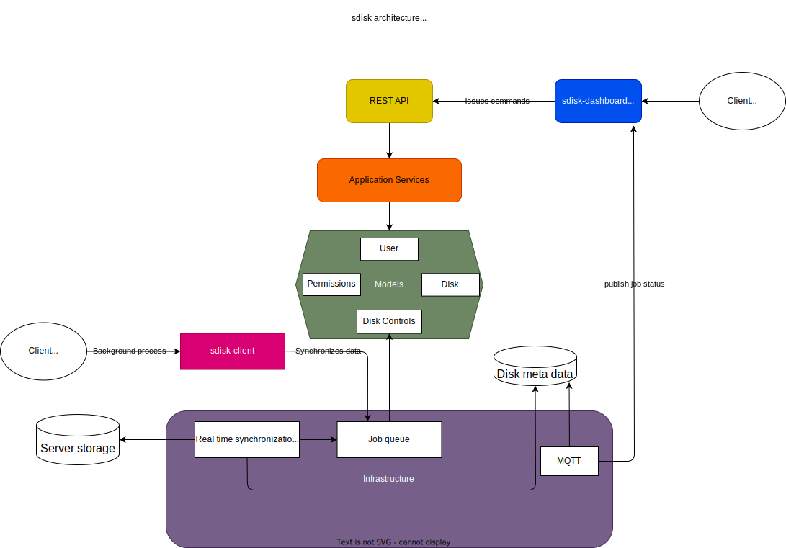

# sdisk ☁️ 🏡 [](https://github.com/Joey-Boivin/sdisk/actions/workflows/sidsk.yml) [](https://opensource.org/licenses/Apache-2.0)

**sdisk** (alias for simple disk) is a network attached storage solution. Users can issue disk control commands with its REST API. They can also synchronize their data in real time. It is, in a funny way, cloud storage at home (both as a joke because it is an oversimplified version of something like OneDrive and also litteraly as it works over a LAN network).

## Why

To put simply, I started this project because it made me excited to learn about a programming language: go. I am building this without any expectation other than having fun building it.

## Developpment information

After changes made to the project, the following command should be run to do some verifications:

```bash
make build lint test
```

### Dependencies and developpment tools
- go 1.22.5
- gnumake
- gotools
- delve
- bruno
- golangci-lint


### Nix users can use the following shell.nix to install all the dev dependencies and export relevant environment variables

```nix
{ pkgs ? import <nixpkgs> {} }:

pkgs.mkShell
{
    nativeBuildInputs = with pkgs; [
        go 
        gnumake 
        gotools
        delve
        bruno
        golangci-lint
    ];

    hardeningDisable = [ "fortify" ];

    shellHook = ''
        export GOPATH=$(pwd)/go
        export PATH=$PATH:$GOPATH/bin
        export SDISK_HOME="$PWD"
        '';
}
```

### Outside of a nix shell

Install relevant dependencies with your package manager of choice.

Export relevant environment variables with

```shell
source scripts/env.sh
```

### Install third party libraries

```shell
go mod tidy
```

## Simplified architecture diagram


